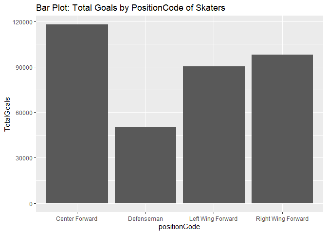

ProjectNHL
================
Deepak Karawande
June 13, 2021

-   [Introduction](#introduction)
-   [Packages](#packages)
-   [Accessing NHL Data](#accessing-nhl-data)
    -   [Contract REST-API and create
        dataframe](#contract-rest-api-and-create-dataframe)
    -   [Fetch data by Id or Name](#fetch-data-by-id-or-name)
    -   [Fetching datafrom NHL Records
        API](#fetching-datafrom-nhl-records-api)
    -   [Wrapper function](#wrapper-function)
-   [Exploratory Data Analysis](#exploratory-data-analysis)
    -   [Combine Franchise Summary and Details in single summary
        table.](#combine-franchise-summary-and-details-in-single-summary-table.)
    -   [Creating new variables](#creating-new-variables)
    -   [Contingency tables](#contingency-tables)
    -   [Numerical summeries](#numerical-summeries)
    -   [Plots](#plots)

# Introduction

This vignette is an introduction on how to query REST-API endpoins using
R and perform exploratory data analysis using various R packages. We’ll
use be using the NHL REST-API endpoints which can be contracted by
folloiwng instruciton on
[https://gitlab.com/dword4/nhlapi/-/blob/master/records-api.md](NHL%20Records%20API)

# Packages

Folloiwng lsit of packages were used for accessing REST-API endpoints
and exploratory data analysis and presentation.

# Accessing NHL Data

## Contract REST-API and create dataframe

NHLAPI project on github provides REST-API endpoints to access various
datapoints for historical NHL games.

For this project, I accessed 7 differnt endpoints from NHLAPI to fetch
information about NHL - 1) Franchise summary 2) Franchise details 3)
Total stats for franchise 4) Season records 5) Skater records 6) Admin
history and retired numbers 7) Team stats

GET function from httr package was used for fetching data through
REST-API. Using content and fromJSON fuction data received was converted
into r dataframe object.

## Fetch data by Id or Name

By default NHL REST-APIs return data for all franchise or team. Using
helpfer functions I created a ability for user to provide Id or Name to
fetch data for sepcific franchise/team if desired. If no Id or Name is
passed query functions will return data for all franchise or teams.

## Fetching datafrom NHL Records API

With the help of wrapper funcions above, created a R function to fetch
data from deisred NHL Records endpoint using either franchise id or team
common name. If franchise id or team common name was not proivided api
will return data from all franchises. Simillar set of fucntions were
used to contract with NHL team stats RES-API end point.

## Wrapper function

Using Switch-Case, created wrapper function for providing simplicity for
fetching data from all NHL REST-API endpoints relvant to this project,

# Exploratory Data Analysis

## Combine Franchise Summary and Details in single summary table.

To explore data, started with combining data from franchise summary and
detail using inner\_join to get basic tabular view of all franchises.
Rendered such summary table using kable function from knitr.

<table class="table" style="margin-left: auto; margin-right: auto;">
<caption>
Franchise Summary Preview
</caption>
<thead>
<tr>
<th style="text-align:right;">
id
</th>
<th style="text-align:left;">
heroImageUrl
</th>
<th style="text-align:left;">
teamCommonName
</th>
<th style="text-align:left;">
active
</th>
</tr>
</thead>
<tbody>
<tr>
<td style="text-align:right;">
1
</td>
<td style="text-align:left;">

</td>
<td style="text-align:left;">
Canadiens
</td>
<td style="text-align:left;">
TRUE
</td>
</tr>
<tr>
<td style="text-align:right;">
2
</td>
<td style="text-align:left;">

</td>
<td style="text-align:left;">
Wanderers
</td>
<td style="text-align:left;">
FALSE
</td>
</tr>
<tr>
<td style="text-align:right;">
3
</td>
<td style="text-align:left;">

</td>
<td style="text-align:left;">
Eagles
</td>
<td style="text-align:left;">
FALSE
</td>
</tr>
<tr>
<td style="text-align:right;">
4
</td>
<td style="text-align:left;">

</td>
<td style="text-align:left;">
Tigers
</td>
<td style="text-align:left;">
FALSE
</td>
</tr>
<tr>
<td style="text-align:right;">
5
</td>
<td style="text-align:left;">

</td>
<td style="text-align:left;">
Maple Leafs
</td>
<td style="text-align:left;">
TRUE
</td>
</tr>
<tr>
<td style="text-align:right;">
6
</td>
<td style="text-align:left;">

</td>
<td style="text-align:left;">
Bruins
</td>
<td style="text-align:left;">
TRUE
</td>
</tr>
<tr>
<td style="text-align:right;">
7
</td>
<td style="text-align:left;">

</td>
<td style="text-align:left;">
Maroons
</td>
<td style="text-align:left;">
FALSE
</td>
</tr>
<tr>
<td style="text-align:right;">
8
</td>
<td style="text-align:left;">

</td>
<td style="text-align:left;">
Americans
</td>
<td style="text-align:left;">
FALSE
</td>
</tr>
<tr>
<td style="text-align:right;">
9
</td>
<td style="text-align:left;">

</td>
<td style="text-align:left;">
Quakers
</td>
<td style="text-align:left;">
FALSE
</td>
</tr>
<tr>
<td style="text-align:right;">
10
</td>
<td style="text-align:left;">

</td>
<td style="text-align:left;">
Rangers
</td>
<td style="text-align:left;">
TRUE
</td>
</tr>
<tr>
<td style="text-align:right;">
11
</td>
<td style="text-align:left;">

</td>
<td style="text-align:left;">
Blackhawks
</td>
<td style="text-align:left;">
TRUE
</td>
</tr>
<tr>
<td style="text-align:right;">
12
</td>
<td style="text-align:left;">

</td>
<td style="text-align:left;">
Red Wings
</td>
<td style="text-align:left;">
TRUE
</td>
</tr>
<tr>
<td style="text-align:right;">
13
</td>
<td style="text-align:left;">

</td>
<td style="text-align:left;">
Barons
</td>
<td style="text-align:left;">
FALSE
</td>
</tr>
<tr>
<td style="text-align:right;">
14
</td>
<td style="text-align:left;">

</td>
<td style="text-align:left;">
Kings
</td>
<td style="text-align:left;">
TRUE
</td>
</tr>
<tr>
<td style="text-align:right;">
15
</td>
<td style="text-align:left;">

</td>
<td style="text-align:left;">
Stars
</td>
<td style="text-align:left;">
TRUE
</td>
</tr>
<tr>
<td style="text-align:right;">
16
</td>
<td style="text-align:left;">

</td>
<td style="text-align:left;">
Flyers
</td>
<td style="text-align:left;">
TRUE
</td>
</tr>
<tr>
<td style="text-align:right;">
17
</td>
<td style="text-align:left;">

</td>
<td style="text-align:left;">
Penguins
</td>
<td style="text-align:left;">
TRUE
</td>
</tr>
<tr>
<td style="text-align:right;">
18
</td>
<td style="text-align:left;">

</td>
<td style="text-align:left;">
Blues
</td>
<td style="text-align:left;">
TRUE
</td>
</tr>
<tr>
<td style="text-align:right;">
19
</td>
<td style="text-align:left;">

</td>
<td style="text-align:left;">
Sabres
</td>
<td style="text-align:left;">
TRUE
</td>
</tr>
<tr>
<td style="text-align:right;">
20
</td>
<td style="text-align:left;">

</td>
<td style="text-align:left;">
Canucks
</td>
<td style="text-align:left;">
TRUE
</td>
</tr>
<tr>
<td style="text-align:right;">
21
</td>
<td style="text-align:left;">

</td>
<td style="text-align:left;">
Flames
</td>
<td style="text-align:left;">
TRUE
</td>
</tr>
<tr>
<td style="text-align:right;">
22
</td>
<td style="text-align:left;">

</td>
<td style="text-align:left;">
Islanders
</td>
<td style="text-align:left;">
TRUE
</td>
</tr>
<tr>
<td style="text-align:right;">
23
</td>
<td style="text-align:left;">

</td>
<td style="text-align:left;">
Devils
</td>
<td style="text-align:left;">
TRUE
</td>
</tr>
<tr>
<td style="text-align:right;">
24
</td>
<td style="text-align:left;">

</td>
<td style="text-align:left;">
Capitals
</td>
<td style="text-align:left;">
TRUE
</td>
</tr>
<tr>
<td style="text-align:right;">
25
</td>
<td style="text-align:left;">

</td>
<td style="text-align:left;">
Oilers
</td>
<td style="text-align:left;">
TRUE
</td>
</tr>
<tr>
<td style="text-align:right;">
26
</td>
<td style="text-align:left;">

</td>
<td style="text-align:left;">
Hurricanes
</td>
<td style="text-align:left;">
TRUE
</td>
</tr>
<tr>
<td style="text-align:right;">
27
</td>
<td style="text-align:left;">

</td>
<td style="text-align:left;">
Avalanche
</td>
<td style="text-align:left;">
TRUE
</td>
</tr>
<tr>
<td style="text-align:right;">
28
</td>
<td style="text-align:left;">

</td>
<td style="text-align:left;">
Coyotes
</td>
<td style="text-align:left;">
TRUE
</td>
</tr>
<tr>
<td style="text-align:right;">
29
</td>
<td style="text-align:left;">

</td>
<td style="text-align:left;">
Sharks
</td>
<td style="text-align:left;">
TRUE
</td>
</tr>
<tr>
<td style="text-align:right;">
30
</td>
<td style="text-align:left;">

</td>
<td style="text-align:left;">
Senators
</td>
<td style="text-align:left;">
TRUE
</td>
</tr>
<tr>
<td style="text-align:right;">
31
</td>
<td style="text-align:left;">

</td>
<td style="text-align:left;">
Lightning
</td>
<td style="text-align:left;">
TRUE
</td>
</tr>
<tr>
<td style="text-align:right;">
32
</td>
<td style="text-align:left;">

</td>
<td style="text-align:left;">
Ducks
</td>
<td style="text-align:left;">
TRUE
</td>
</tr>
<tr>
<td style="text-align:right;">
33
</td>
<td style="text-align:left;">

</td>
<td style="text-align:left;">
Panthers
</td>
<td style="text-align:left;">
TRUE
</td>
</tr>
<tr>
<td style="text-align:right;">
34
</td>
<td style="text-align:left;">

</td>
<td style="text-align:left;">
Predators
</td>
<td style="text-align:left;">
TRUE
</td>
</tr>
<tr>
<td style="text-align:right;">
35
</td>
<td style="text-align:left;">

</td>
<td style="text-align:left;">
Jets
</td>
<td style="text-align:left;">
TRUE
</td>
</tr>
<tr>
<td style="text-align:right;">
36
</td>
<td style="text-align:left;">

</td>
<td style="text-align:left;">
Blue Jackets
</td>
<td style="text-align:left;">
TRUE
</td>
</tr>
<tr>
<td style="text-align:right;">
37
</td>
<td style="text-align:left;">

</td>
<td style="text-align:left;">
Wild
</td>
<td style="text-align:left;">
TRUE
</td>
</tr>
<tr>
<td style="text-align:right;">
38
</td>
<td style="text-align:left;">

</td>
<td style="text-align:left;">
Golden Knights
</td>
<td style="text-align:left;">
TRUE
</td>
</tr>
<tr>
<td style="text-align:right;">
39
</td>
<td style="text-align:left;">
NA
</td>
<td style="text-align:left;">
Kraken
</td>
<td style="text-align:left;">
TRUE
</td>
</tr>
</tbody>
</table>

## Creating new variables

There are many ways to compute/add more variables to the dataset you are
working with. I used group\_by and summarise functions toc create two
new varaibles totalWins and toalLosses for each unique combinatoin of
Franchise Id & Team. Also computed percentage wins for each such
combination of Franchise Id & Team using total wins and total losses.

<table class="table" style="margin-left: auto; margin-right: auto;">
<caption>
Win/Loss Percentages by Franchise & Teams
</caption>
<thead>
<tr>
<th style="text-align:right;">
franchiseId
</th>
<th style="text-align:left;">
teamName
</th>
<th style="text-align:right;">
totalWins
</th>
<th style="text-align:right;">
totalLosses
</th>
<th style="text-align:right;">
perWins
</th>
</tr>
</thead>
<tbody>
<tr>
<td style="text-align:right;">
38
</td>
<td style="text-align:left;">
Vegas Golden Knights
</td>
<td style="text-align:right;">
210
</td>
<td style="text-align:right;">
120
</td>
<td style="text-align:right;">
0.64
</td>
</tr>
<tr>
<td style="text-align:right;">
1
</td>
<td style="text-align:left;">
Montréal Canadiens
</td>
<td style="text-align:right;">
3917
</td>
<td style="text-align:right;">
2623
</td>
<td style="text-align:right;">
0.60
</td>
</tr>
<tr>
<td style="text-align:right;">
15
</td>
<td style="text-align:left;">
Dallas Stars
</td>
<td style="text-align:right;">
1189
</td>
<td style="text-align:right;">
833
</td>
<td style="text-align:right;">
0.59
</td>
</tr>
<tr>
<td style="text-align:right;">
16
</td>
<td style="text-align:left;">
Philadelphia Flyers
</td>
<td style="text-align:right;">
2310
</td>
<td style="text-align:right;">
1670
</td>
<td style="text-align:right;">
0.58
</td>
</tr>
<tr>
<td style="text-align:right;">
27
</td>
<td style="text-align:left;">
Colorado Avalanche
</td>
<td style="text-align:right;">
1131
</td>
<td style="text-align:right;">
822
</td>
<td style="text-align:right;">
0.58
</td>
</tr>
<tr>
<td style="text-align:right;">
6
</td>
<td style="text-align:left;">
Boston Bruins
</td>
<td style="text-align:right;">
3573
</td>
<td style="text-align:right;">
2740
</td>
<td style="text-align:right;">
0.57
</td>
</tr>
</tbody>
</table>

## Contingency tables

Contengency tables were created for Total goals scored by saketers by
his position and franchise Id. 2 seperate tables were cerated by
considering active and inactive players.

<table class="table" style="margin-left: auto; margin-right: auto;">
<caption>
Active Players: Goal Counts by FranchiseID and Position
</caption>
<thead>
<tr>
<th style="text-align:left;">
franchiseName
</th>
<th style="text-align:right;">
Center Forward
</th>
<th style="text-align:right;">
Defenseman
</th>
<th style="text-align:right;">
Left Wing Forward
</th>
<th style="text-align:right;">
Right Wing Forward
</th>
</tr>
</thead>
<tbody>
<tr>
<td style="text-align:left;">
Anaheim Ducks
</td>
<td style="text-align:right;">
677
</td>
<td style="text-align:right;">
237
</td>
<td style="text-align:right;">
308
</td>
<td style="text-align:right;">
797
</td>
</tr>
<tr>
<td style="text-align:left;">
Arizona Coyotes
</td>
<td style="text-align:right;">
294
</td>
<td style="text-align:right;">
351
</td>
<td style="text-align:right;">
200
</td>
<td style="text-align:right;">
272
</td>
</tr>
<tr>
<td style="text-align:left;">
Boston Bruins
</td>
<td style="text-align:right;">
1020
</td>
<td style="text-align:right;">
359
</td>
<td style="text-align:right;">
663
</td>
<td style="text-align:right;">
420
</td>
</tr>
<tr>
<td style="text-align:left;">
Buffalo Sabres
</td>
<td style="text-align:right;">
450
</td>
<td style="text-align:right;">
217
</td>
<td style="text-align:right;">
377
</td>
<td style="text-align:right;">
218
</td>
</tr>
<tr>
<td style="text-align:left;">
Calgary Flames
</td>
<td style="text-align:right;">
600
</td>
<td style="text-align:right;">
308
</td>
<td style="text-align:right;">
434
</td>
<td style="text-align:right;">
96
</td>
</tr>
<tr>
<td style="text-align:left;">
Carolina Hurricanes
</td>
<td style="text-align:right;">
970
</td>
<td style="text-align:right;">
244
</td>
<td style="text-align:right;">
471
</td>
<td style="text-align:right;">
110
</td>
</tr>
</tbody>
</table>
<table class="table" style="margin-left: auto; margin-right: auto;">
<caption>
Inactive Players: Goal Counts by FranchiseID and Position
</caption>
<thead>
<tr>
<th style="text-align:left;">
franchiseName
</th>
<th style="text-align:right;">
Center Forward
</th>
<th style="text-align:right;">
Defenseman
</th>
<th style="text-align:right;">
Left Wing Forward
</th>
<th style="text-align:right;">
Right Wing Forward
</th>
</tr>
</thead>
<tbody>
<tr>
<td style="text-align:left;">
Anaheim Ducks
</td>
<td style="text-align:right;">
982
</td>
<td style="text-align:right;">
622
</td>
<td style="text-align:right;">
1084
</td>
<td style="text-align:right;">
915
</td>
</tr>
<tr>
<td style="text-align:left;">
Arizona Coyotes
</td>
<td style="text-align:right;">
2615
</td>
<td style="text-align:right;">
1203
</td>
<td style="text-align:right;">
2162
</td>
<td style="text-align:right;">
2563
</td>
</tr>
<tr>
<td style="text-align:left;">
Boston Bruins
</td>
<td style="text-align:right;">
5667
</td>
<td style="text-align:right;">
2658
</td>
<td style="text-align:right;">
4986
</td>
<td style="text-align:right;">
5271
</td>
</tr>
<tr>
<td style="text-align:left;">
Brooklyn Americans
</td>
<td style="text-align:right;">
519
</td>
<td style="text-align:right;">
202
</td>
<td style="text-align:right;">
519
</td>
<td style="text-align:right;">
403
</td>
</tr>
<tr>
<td style="text-align:left;">
Buffalo Sabres
</td>
<td style="text-align:right;">
3516
</td>
<td style="text-align:right;">
1346
</td>
<td style="text-align:right;">
2852
</td>
<td style="text-align:right;">
3413
</td>
</tr>
<tr>
<td style="text-align:left;">
Calgary Flames
</td>
<td style="text-align:right;">
3436
</td>
<td style="text-align:right;">
1497
</td>
<td style="text-align:right;">
2295
</td>
<td style="text-align:right;">
3596
</td>
</tr>
</tbody>
</table>

## Numerical summeries

Numerical summeries were created for toals, gamesPlayed,
mostGoalsOneGame, mostGoalsOneSeason by skaters with differnt positions
as follows -
<table class="table" style="margin-left: auto; margin-right: auto;">
<caption>
Summary Goals by Position Center Forward
</caption>
<thead>
<tr>
<th style="text-align:left;">
</th>
<th style="text-align:right;">
goals
</th>
<th style="text-align:right;">
gamesPlayed
</th>
<th style="text-align:right;">
mostGoalsOneGame
</th>
<th style="text-align:right;">
mostGoalsOneSeason
</th>
</tr>
</thead>
<tbody>
<tr>
<td style="text-align:left;">
Min.
</td>
<td style="text-align:right;">
0.0
</td>
<td style="text-align:right;">
1.0
</td>
<td style="text-align:right;">
0.0
</td>
<td style="text-align:right;">
0.0
</td>
</tr>
<tr>
<td style="text-align:left;">
1st Qu.
</td>
<td style="text-align:right;">
1.0
</td>
<td style="text-align:right;">
15.0
</td>
<td style="text-align:right;">
1.0
</td>
<td style="text-align:right;">
1.0
</td>
</tr>
<tr>
<td style="text-align:left;">
Median
</td>
<td style="text-align:right;">
6.0
</td>
<td style="text-align:right;">
55.0
</td>
<td style="text-align:right;">
1.0
</td>
<td style="text-align:right;">
5.0
</td>
</tr>
<tr>
<td style="text-align:left;">
Mean
</td>
<td style="text-align:right;">
27.6
</td>
<td style="text-align:right;">
121.2
</td>
<td style="text-align:right;">
1.4
</td>
<td style="text-align:right;">
9.4
</td>
</tr>
<tr>
<td style="text-align:left;">
3rd Qu.
</td>
<td style="text-align:right;">
26.0
</td>
<td style="text-align:right;">
148.0
</td>
<td style="text-align:right;">
2.0
</td>
<td style="text-align:right;">
14.0
</td>
</tr>
<tr>
<td style="text-align:left;">
Max.
</td>
<td style="text-align:right;">
692.0
</td>
<td style="text-align:right;">
1607.0
</td>
<td style="text-align:right;">
7.0
</td>
<td style="text-align:right;">
92.0
</td>
</tr>
</tbody>
</table>
<table class="table" style="margin-left: auto; margin-right: auto;">
<caption>
Summary Goals by Position Defenseman
</caption>
<thead>
<tr>
<th style="text-align:left;">
</th>
<th style="text-align:right;">
goals
</th>
<th style="text-align:right;">
gamesPlayed
</th>
<th style="text-align:right;">
mostGoalsOneGame
</th>
<th style="text-align:right;">
mostGoalsOneSeason
</th>
</tr>
</thead>
<tbody>
<tr>
<td style="text-align:left;">
Min.
</td>
<td style="text-align:right;">
0.0
</td>
<td style="text-align:right;">
1
</td>
<td style="text-align:right;">
0.0
</td>
<td style="text-align:right;">
0.0
</td>
</tr>
<tr>
<td style="text-align:left;">
1st Qu.
</td>
<td style="text-align:right;">
0.0
</td>
<td style="text-align:right;">
15
</td>
<td style="text-align:right;">
0.0
</td>
<td style="text-align:right;">
0.0
</td>
</tr>
<tr>
<td style="text-align:left;">
Median
</td>
<td style="text-align:right;">
2.0
</td>
<td style="text-align:right;">
56
</td>
<td style="text-align:right;">
1.0
</td>
<td style="text-align:right;">
2.0
</td>
</tr>
<tr>
<td style="text-align:left;">
Mean
</td>
<td style="text-align:right;">
8.7
</td>
<td style="text-align:right;">
117
</td>
<td style="text-align:right;">
0.9
</td>
<td style="text-align:right;">
3.4
</td>
</tr>
<tr>
<td style="text-align:left;">
3rd Qu.
</td>
<td style="text-align:right;">
8.0
</td>
<td style="text-align:right;">
150
</td>
<td style="text-align:right;">
1.0
</td>
<td style="text-align:right;">
5.0
</td>
</tr>
<tr>
<td style="text-align:left;">
Max.
</td>
<td style="text-align:right;">
395.0
</td>
<td style="text-align:right;">
1564
</td>
<td style="text-align:right;">
5.0
</td>
<td style="text-align:right;">
48.0
</td>
</tr>
</tbody>
</table>
<table class="table" style="margin-left: auto; margin-right: auto;">
<caption>
Summary Goals by Position Left Wing Forward
</caption>
<thead>
<tr>
<th style="text-align:left;">
</th>
<th style="text-align:right;">
goals
</th>
<th style="text-align:right;">
gamesPlayed
</th>
<th style="text-align:right;">
mostGoalsOneGame
</th>
<th style="text-align:right;">
mostGoalsOneSeason
</th>
</tr>
</thead>
<tbody>
<tr>
<td style="text-align:left;">
Min.
</td>
<td style="text-align:right;">
0.0
</td>
<td style="text-align:right;">
1.0
</td>
<td style="text-align:right;">
0.0
</td>
<td style="text-align:right;">
0.0
</td>
</tr>
<tr>
<td style="text-align:left;">
1st Qu.
</td>
<td style="text-align:right;">
1.0
</td>
<td style="text-align:right;">
14.0
</td>
<td style="text-align:right;">
1.0
</td>
<td style="text-align:right;">
1.0
</td>
</tr>
<tr>
<td style="text-align:left;">
Median
</td>
<td style="text-align:right;">
5.0
</td>
<td style="text-align:right;">
52.0
</td>
<td style="text-align:right;">
1.0
</td>
<td style="text-align:right;">
4.0
</td>
</tr>
<tr>
<td style="text-align:left;">
Mean
</td>
<td style="text-align:right;">
24.1
</td>
<td style="text-align:right;">
110.5
</td>
<td style="text-align:right;">
1.4
</td>
<td style="text-align:right;">
8.8
</td>
</tr>
<tr>
<td style="text-align:left;">
3rd Qu.
</td>
<td style="text-align:right;">
24.0
</td>
<td style="text-align:right;">
141.0
</td>
<td style="text-align:right;">
2.0
</td>
<td style="text-align:right;">
14.0
</td>
</tr>
<tr>
<td style="text-align:left;">
Max.
</td>
<td style="text-align:right;">
730.0
</td>
<td style="text-align:right;">
1436.0
</td>
<td style="text-align:right;">
6.0
</td>
<td style="text-align:right;">
65.0
</td>
</tr>
</tbody>
</table>
<table class="table" style="margin-left: auto; margin-right: auto;">
<caption>
Summary Goals by Position Right Wing Forward
</caption>
<thead>
<tr>
<th style="text-align:left;">
</th>
<th style="text-align:right;">
goals
</th>
<th style="text-align:right;">
gamesPlayed
</th>
<th style="text-align:right;">
mostGoalsOneGame
</th>
<th style="text-align:right;">
mostGoalsOneSeason
</th>
</tr>
</thead>
<tbody>
<tr>
<td style="text-align:left;">
Min.
</td>
<td style="text-align:right;">
0.0
</td>
<td style="text-align:right;">
1.0
</td>
<td style="text-align:right;">
0.0
</td>
<td style="text-align:right;">
0.0
</td>
</tr>
<tr>
<td style="text-align:left;">
1st Qu.
</td>
<td style="text-align:right;">
1.0
</td>
<td style="text-align:right;">
15.0
</td>
<td style="text-align:right;">
1.0
</td>
<td style="text-align:right;">
1.0
</td>
</tr>
<tr>
<td style="text-align:left;">
Median
</td>
<td style="text-align:right;">
6.0
</td>
<td style="text-align:right;">
53.0
</td>
<td style="text-align:right;">
1.0
</td>
<td style="text-align:right;">
5.0
</td>
</tr>
<tr>
<td style="text-align:left;">
Mean
</td>
<td style="text-align:right;">
28.2
</td>
<td style="text-align:right;">
117.9
</td>
<td style="text-align:right;">
1.5
</td>
<td style="text-align:right;">
9.9
</td>
</tr>
<tr>
<td style="text-align:left;">
3rd Qu.
</td>
<td style="text-align:right;">
27.0
</td>
<td style="text-align:right;">
146.5
</td>
<td style="text-align:right;">
2.0
</td>
<td style="text-align:right;">
15.0
</td>
</tr>
<tr>
<td style="text-align:left;">
Max.
</td>
<td style="text-align:right;">
786.0
</td>
<td style="text-align:right;">
1687.0
</td>
<td style="text-align:right;">
5.0
</td>
<td style="text-align:right;">
86.0
</td>
</tr>
</tbody>
</table>

## Plots

You should create at least five plots utilizing coloring, grouping, etc.
All plots should have nice labels and titles.
<!-- --><!-- --><!-- --><!-- -->

sdfd

    ##  [1] 15 28 11 25 16 18 24 20 13  5  6  3  4  2  9 12  7  8 31 10  1 27
    ## [23] 22 21 23 29 32 33 30 19 37 26 17 38 34 35 14 36
